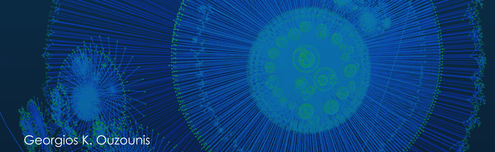

# Data Science

This section lists a collection of data science resources published by third parties for educational purposes. Please contact the individual authors for more.

## Tutorial set 01, by Lauren Glass

The following jupyter notebook files were created manually by copying the code snippets from the original articles and making minor changes for compatibility issues.

| title | format | author | date | blog |
|-------|--------|--------|------|------|
| [NumPy](./tutorial-set-01/tutorial_1_numpy.ipynb) | jupyter notebook (.ipynb) | Lauren Glass | Dec. 20, 2017 | [Hackernoon](https://hackernoon.com/fundamental-python-data-science-libraries-a-cheatsheet-part-1-4-58884e95c2bd) |
| [Pandas](./tutorial-set-01/tutorial_2_pandas.ipynb) | jupyter notebook (.ipynb) | Lauren Glass | Jan. 17, 2018 | [Hackernoon](https://hackernoon.com/fundamental-python-data-science-libraries-a-cheatsheet-part-2-4-fcf5fab9cdf1) |
| [MatplotLib](./tutorial-set-01/tutorial_3_matplotlib.ipynb) | jupyter notebook (.ipynb) | Lauren Glass | Aug. 07, 2018 | [Hackernoon](https://hackernoon.com/fundamental-python-data-science-libraries-a-cheatsheet-part-3-4-6c2aecc697a4) |

## Contact Me

Contact [Georgios Ouzounis](mailto:georgios.ouzounis@gmail.com)
